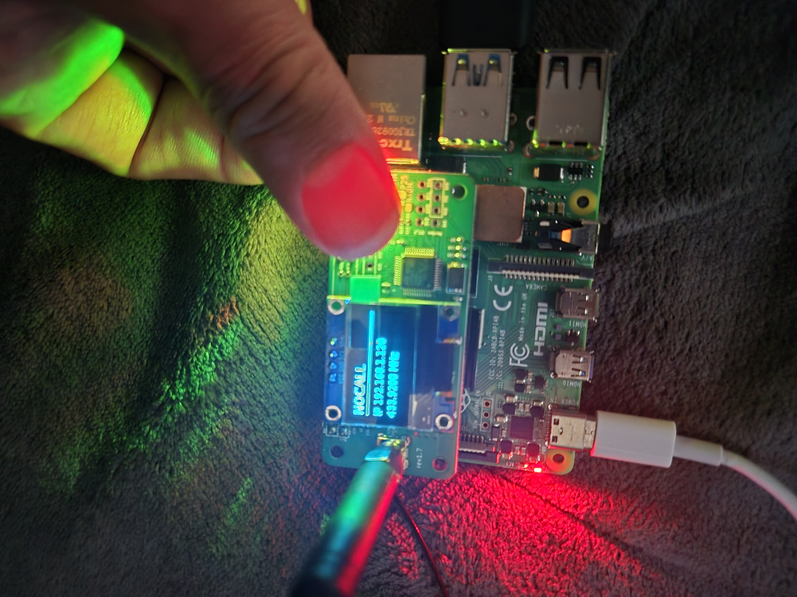

# POCSAG Pager Transmitter

A standalone **POCSAG pager transmitter** for the Raspberry Pi using a factory
**MMDVM_HS_Hat** hotspot — **no Pi-Star, no DAPNET**. One installer script
(`install-pocsag.sh`) builds and configures everything from a clean OS: it
builds MMDVMHost, frees the GPIO UART, sets up an MQTT broker, installs a
boot-time service, optionally drives a small OLED display, and gives you a
`sendpage` command to transmit a page.



> ⚠️ **Legal:** transmitting on the air requires a valid **amateur radio
> licence**, and you are responsible for using a frequency, mode and power that
> are legal for your licence in your country. The default 433.920 MHz is only an
> example.

## Hardware

| Item | Notes |
|------|-------|
| **Raspberry Pi 4** | Tested. Pi 3 / Zero 2 W should work but are untested. |
| **MMDVM_HS_Hat** | Single ADF7021, simplex, on the 40-pin GPIO header (BOOT0 = GPIO20, RESET = GPIO21). https://www.amazon.se/Hotspot-Raspbery-Digital-Worldwide-OLED-sk%C3%A4rm/dp/B0DN1B7LKR/|
| **0.96" SSD1306 OLED** *(optional)* | I²C, 128×64. |
| **A POCSAG pager** | Set to your frequency, the paged RIC, 1200 baud, POCSAG. |
| **microSD + PSU** | Standard Pi essentials. |

The hat just seats on all 40 GPIO pins. The optional OLED wires to the Pi's
I²C1 bus: **VCC → pin 1 (3.3 V)**, **GND → pin 6**, **SDA → pin 3**,
**SCL → pin 5**.

## Requirements

- **Raspberry Pi OS Lite (64-bit)** — flash with Raspberry Pi Imager.
- An MMDVM_HS_Hat on the GPIO header.
- Network/SSH access to the Pi.

Everything else (build tools, MMDVMHost, mosquitto, OLED libraries) is installed
by the script.

## Installation

```bash
git clone https://github.com/<your-user>/<your-repo>.git
cd <your-repo>
sudo bash install-pocsag.sh
```

Answer the prompts (callsign, frequency, test RIC). On **flash firmware?** answer
**N** if your hat already works (firmware lives on the hat's own chip); answer
**y** only if it's brand-new/blank (only the PWR LED lights, no blinking
heartbeat). Choose **Y** for OLED if you have the screen.

The installer **reboots automatically** at the end (10-second countdown, cancel
with `Ctrl-C`). The reboot is required — freeing the GPIO UART and enabling I²C
only take effect after a restart. The services then start on their own.

## Usage

```bash
sendpage 1234567 "hello world"          # send a page
systemctl status pocsag --no-pager      # check the service
journalctl -u pocsag -n 20              # check the logs
```

Set your pager to the chosen frequency, the paged RIC, **1200 baud, POCSAG**.
Pages are limited to 80 characters.

**Blank hat?** After the reboot, flash it with `sudo hs-flash` (only if it's
actually blank).

## How it works

MMDVMHost is the POCSAG engine, talking to the hat over the GPIO UART at 115200
baud (POCSAG only). It takes commands over MQTT, so a local **mosquitto** broker
runs with two listeners: `127.0.0.1:1883` (anonymous, loopback, for MMDVMHost)
and `0.0.0.0:1884` (login required, for remote clients). A page is just
`page <RIC> <message>` published to the topic `mmdvm/command`. The optional OLED
daemon subscribes to that same topic, so it reflects pages from both `sendpage`
and the remote GUI.

## Remote client (workstation)

The included `pager_client.py` (Python/Tkinter) sends pages from another
computer:

```bash
pip install paho-mqtt          # plus 'sudo apt install python3-tk' on Linux
python3 pager_client.py
```

Connect to the Pi's IP, port `1884`, user `mqtt`, password `Password`
(**change this** — see below). Settings save to `~/.pager_client.json`
(password is never stored).

## OLED display

When installed, the `oled` service shows callsign / IP / frequency while idle,
and **TX POCSAG + RIC** while paging. Quick check (stop the daemon first so it
doesn't fight over the bus):

```bash
sudo systemctl stop oled
i2cdetect -y 1            # expect 3c (sometimes 3d)
sudo systemctl start oled
```

For a different address, a 128×32 panel, or an upside-down mount, edit the
commented `Environment=` lines in `/etc/systemd/system/oled.service`, then
`sudo systemctl daemon-reload && sudo systemctl restart oled`.

## Troubleshooting

**mosquitto won't start during install** — the password file must be readable by
the `mosquitto` user:
```bash
sudo chown root:mosquitto /etc/mosquitto/passwd
sudo chmod 640 /etc/mosquitto/passwd
sudo systemctl restart mosquitto
```

**OLED blank / `/dev/i2c-1` missing** — `dtparam=i2c_arm=on` enables the I²C
controller but the `i2c-dev` module creates the device node:
```bash
sudo raspi-config nonint do_i2c 0
echo i2c-dev | sudo tee /etc/modules-load.d/i2c-dev.conf
sudo modprobe i2c-dev
sudo i2cdetect -y 1        # should show 3c
```

**Bus visible but no `3c`/`3d`** — wiring issue, recheck the four OLED pins.

(The current installer already handles both fixes above.)

## Key paths

`/etc/pocsag/MMDVM.ini` · `/etc/mosquitto/conf.d/pager.conf` ·
`/etc/systemd/system/{pocsag,oled}.service` · `/opt/oled/oled-status.py` ·
`/usr/local/bin/{sendpage,hs-flash,hs-reset}`

## Security

The MQTT listener binds `0.0.0.0:1884` with the default password `Password` —
**change it** and keep the Pi on a trusted LAN (don't expose port 1884 to the
internet):
```bash
sudo mosquitto_passwd /etc/mosquitto/passwd mqtt
sudo systemctl restart mosquitto
```

## Credits & licence

Built on [MMDVMHost](https://github.com/g4klx/MMDVMHost) (G4KLX),
[MMDVM_HS](https://github.com/juribeparada/MMDVM_HS) firmware (CA6JAU),
[mosquitto](https://mosquitto.org/), and
[luma.oled](https://github.com/rm-hull/luma.oled). For amateur radio and
educational use only; use only on frequencies and power you are licensed for. No
warranty.
